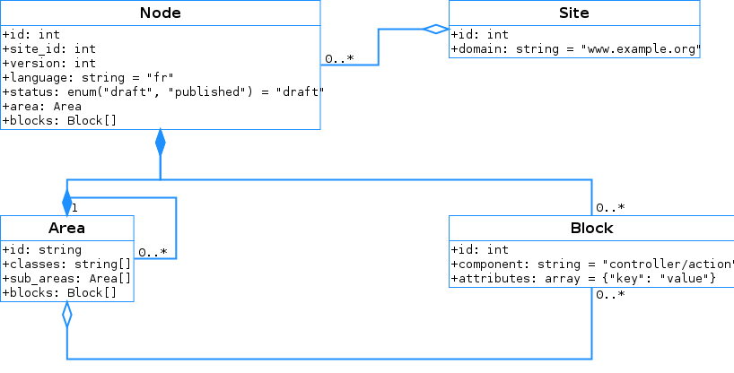

Architecture PHP Orchestra
==========================

1. Introduction
---------------

Ceci est un document de travail, voué à évoluer et poser les bonnes questions,
avant que toute architecture ne soit validée.

2. Fonctionnalités attendues
-----------------------------

Liste des fonctionnalités qui sont souhaitées pour PHP Orchestra, qu'elles
soient héritées ou non de PHP Factory.

| Fonctionnalité    | Commentaire                                              |
|-------------------|----------------------------------------------------------|
| HMVC CMS          | Symfony supporte le forward aux controllers et ESI       |
| NoSQL             | Support de MongoDB et couche d'abstraction via Mandango  |
| Multi-device      | WURFL or other lib                                       |
| Multi-site        | Multi-app ?                                              |
| i18n/l10n         | Sf2 native                                               |
| Médiathèque       | Reprendre les médiathèques évoluées de PHP Factory       |
| RAD               | Prévoir le déploiement rapide de nouveaux écrans BO      |
| Refonte ergo BO   | Voir thème bootstrap Ajax sélectionné par R. Carles      |
| Inline editing    | Priorité moindre                                         |
| Legacy compat.    | En S2, faciliter la migration des projets PHP Factory    |
| Extensibilité     | Possibilité de greffer des produits tiers (smart, etc.)  |


3. Normes de développement
--------------------------

### 3.1 Répertoires

    .
    ├── build # Scripts to build project, launch unit tests, etc.
    ├── conf  # Basic system configuration
    │   ├── apache2
    │   ├── mongodb
    │   ├── php
    │   └── varnish
    ├── doc  # Project-wide documentation 
    └── src  # Sources
        └── symfony2


### 3.2 Où placer les développements

Les développements Symfony2 seront placés en tant que bundles dans le répertoire
vendor de Symfony2 :
`./src/symfony2/vendor/php-orchestra/nom-du-bundle-en-minuscules-et-tirets`

### 3.3 Autoloading

Les normes PSR-0 et PSR-4 sont toutes les deux possibles.

Pour le moment nous commencerons avec PSR-0 comme standard.
http://www.sitepoint.com/battle-autoloaders-psr-0-vs-psr-4/

Ce choix n'est pas définitif.

### 3.4 Namespace

En accord avec la norme *PSR-0* ou *PSR-4*, les 2 premiers niveaux du namespace
sont *vendor\package*, dans notre cas, le vendor sera systématiquement
**PHPOrchestra\NomDuBundle**, par exemple :
- PHPOrchestra\CMSBundle
- PHPOrchestra\CoreBundle
- PHPOrchestra\LegacyBundle
- PHPOrchestra\UserBundle
- PHPOrchestra\MediaBundle

### 3.5 Conventions d'écriture

Nous suivrons les normes PSR-1 et PSR-2 pour les conventions d'écriture.
http://www.php-fig.org/psr/psr-1/
http://www.php-fig.org/psr/psr-2/

Et résumées ici pour Symfony :
http://symfony.com/doc/current/contributing/code/standards.html

Les règles seront intégrées à la plateforme d'intégration continue.

### 3.6 Tests unitaires

Tous les développements sensibles du noyau seront testés en utilisant PHPUnit.
Les tests seront intégrés à la plateforme d'intégration continue.

### 3.7 Plateforme d'intégration continue

Travis-ci sera utilisé. (voir Pascal pour la mise en place)
+Scrutinizer

4. Modèle de données
--------------------

### 4.1 Base de données

La base de données principale sera en MongoDB

### 4.2 Modèle de données



#### 4.2.1 Collection site

```json
{
  "_id": 1,
  "domain": "www.example.org",
  "language": "en"
}
```

#### 4.2.2 Collection node

```json
{
    "_id": 1,
    "site_id": 1,
    "parent_id": null,
    "path": "/1",
    "name": "home",
    "version": 4
    "language": "fr",
    "status": "published",
    "template_id": 42,
    "blocks":
    {
        "1":
        {
            "component": "controller/action",
            "attributes":
            {
                "custom_attribute": "value",
                "custom_attribute": "value",
                "custom_attribute": "value",
                "custom_attribute": "value"
                //, etc.
            }
        }
        //, etc.
    },
    "area":
    {
        "id": "html_id", // HTML identifier like "container", "header", "footer"
        "classes" : ["class1"/*, etc. */], // Additional HTML classes
        "sub_areas":
        [
            {
                "id": "html_id",
                "classes": ["classN"],

                // Usually blocks are in area leaves, so you *should* find
                // either blocks or sub_areas, but not both
                "blocks":
                [
                    {
                        "node_id": null, // null = current node
                        "block_id": "1"
                    }
                    //, etc.
                ],

                "sub_areas":
                [
                    // etc. Unlimited level of recursive areas
                ]
            }
            //, etc. Unlimited number of areas
        ]
    }
}
```

#### 4.2.3 Collection content

#### 4.2.4 Collection user
